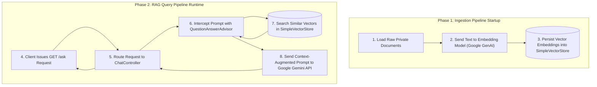

# ⚡ Spring AI Embeddings & Vector RAG Demo

[](https://spring.io/projects/spring-boot)
[](https://spring.io/projects/spring-ai)
[](https://www.oracle.com/java/)
[](https://ai.google.dev/)
[](LICENSE)

> A production-ready, lightweight implementation of **Retrieval-Augmented Generation (RAG)** built with **Spring AI**, **Google GenAI (Gemini)**, and an **In-Memory SimpleVectorStore**.

---

## 📌 Executive Summary

Large Language Models (LLMs) are trained on vast amounts of public data, but they lack knowledge of your private, domain-specific, or internal enterprise data. Standard prompt engineering often fails due to token context limits.

This repository demonstrates how to implement **Retrieval-Augmented Generation (RAG)** using **Spring AI**. By converting proprietary documents into numerical vector embeddings and storing them in an in-memory vector database, the application dynamically retrieves relevant context and injects it into LLM prompts at runtime—enabling accurate, context-aware answers without expensive model fine-tuning.

---

## 🏗️ System Architecture

The architecture operates in two distinct operational phases with an explicit execution order: **Document Ingestion** at application startup, followed by **Runtime RAG Execution** during API calls.



### Execution Flow Sequence

#### Phase 1: Ingestion Pipeline (Application Startup)
1. **Load Raw Private Documents**: A Spring `CommandLineRunner` initializes enterprise text snippets in memory.
2. **Generate Embeddings**: Document text is sent to Google GenAI's `text-embedding-004` model to compute 768-dimensional vector representations.
3. **Persist Vectors**: The generated embeddings and document payloads are indexed into `SimpleVectorStore`.

#### Phase 2: RAG Query Pipeline (Runtime Request)
4. **Client Request**: The user submits a question via `GET /ask?question=...`.
5. **Controller Handling**: `ChatController` receives the incoming request.
6. **Advisor Interception**: Spring AI's `QuestionAnswerAdvisor` intercepts the user prompt.
7. **Similarity Search**: Performs a mathematical vector search against `SimpleVectorStore` to retrieve top relevant documents, returning them to the advisor.
8. **Augmented Prompt Completion**: The advisor combines the user query with the retrieved documents into an augmented system prompt and sends it to `gemini-2.5-flash`, which returns the final answer back to the client.


---

## ✨ Key Features

* **Zero-Infrastructure Setup**: Leverages Spring AI's native `SimpleVectorStore` in-memory setup—no external database (e.g., PgVector, Pinecone) required for local testing.
* **Automated Context Injection**: Uses Spring AI's `QuestionAnswerAdvisor` to intercept requests and handle prompt engineering seamlessly.
* **Decoupled Architecture**: Clear separation of concerns with isolated configuration beans and controller components.
* **Built-in Inspection Tool**: Exposes an inspection endpoint (`/vectorstore/inspect`) to visualize indexed vectors and text chunks directly.

---

## 🛠️ Tech Stack & Dependencies

| Component | Technology / Framework | Purpose |
| --- | --- | --- |
| **Framework** | Spring Boot 3.x | Enterprise application backbone |
| **AI Abstraction** | Spring AI 1.0+ | Unified framework for LLM & Vector Database integrations |
| **LLM Model** | Google GenAI `gemini-2.5-flash` | Fast, low-latency generative completions |
| **Embedding Model** | Google GenAI `text-embedding-004` | High-dimensional text-to-vector conversion |
| **Vector Store** | Spring AI `SimpleVectorStore` | In-memory vector database for semantic search |
| **Build System** | Apache Maven | Dependency management & compilation |

---

## 🚀 Getting Started

### Prerequisites

* **Java 17** or higher
* **Maven 3.8+**
* **Google Gemini API Key** ([Obtain key from Google AI Studio](https://aistudio.google.com/))

### Configuration (`application.properties`)

Configure your connection settings in `src/main/resources/application.properties`:

```properties
spring.application.name=springai-embeddings-vector-rag-demo-1

# Core Google GenAI Configuration
spring.ai.google.genai.api-key=${GEMINI_API_KEY}
spring.ai.google.genai.project-id=your-project-id
spring.ai.google.genai.location=us-central1
spring.ai.google.genai.chat.options.model=gemini-2.5-flash

# Google GenAI Embeddings Configuration
spring.ai.google.genai.embedding.api-key=${GEMINI_API_KEY}
spring.ai.google.genai.embedding.project-id=your-project-id
spring.ai.google.genai.embedding.location=global
spring.ai.google.genai.embedding.options.model=text-embedding-004

```

### Environment Variable Setup

To keep secrets secure, set your API key as an environment variable before starting the application:

* **Linux / macOS:**
```bash
export GEMINI_API_KEY="your_actual_google_api_key_here"

```


* **Windows (Command Prompt):**
```cmd
set GEMINI_API_KEY=your_actual_google_api_key_here

```


* **Windows (PowerShell):**
```powershell
$env:GEMINI_API_KEY="your_actual_google_api_key_here"

```


---

## 📂 Source Code Structure

```
src/main/java/com/unicodes/springai_embeddings_vector_rag_demo_1/
│
├── SpringaiEmbeddingsVectorRagDemo1Application.java  # Main Class & VectorStore Bean Setup
├── ChatController.java                               # REST Endpoint for RAG Chat Completion
└── VectorStoreInspectorController.java              # REST Endpoint to Inspect Vector Store

```

### 1. Application & Ingestion Setup (`SpringaiEmbeddingsVectorRagDemo1Application.java`)

```java
package com.unicodes.springai_embeddings_vector_rag_demo_1;

import org.springframework.ai.document.Document;
import org.springframework.ai.embedding.EmbeddingModel;
import org.springframework.ai.vectorstore.SimpleVectorStore;
import org.springframework.ai.vectorstore.VectorStore;
import org.springframework.boot.CommandLineRunner;
import org.springframework.boot.SpringApplication;
import org.springframework.boot.autoconfigure.SpringBootApplication;
import org.springframework.context.annotation.Bean;

import java.util.List;

@SpringBootApplication
public class SpringaiEmbeddingsVectorRagDemo1Application {

    public static void main(String[] args) {
        SpringApplication.run(SpringaiEmbeddingsVectorRagDemo1Application.class, args);
    }

    @Bean
    public VectorStore vectorStore(EmbeddingModel embeddingModel) {
        return SimpleVectorStore.builder(embeddingModel).build();
    }

    @Bean
    public CommandLineRunner initDatabase(VectorStore vectorStore) {
        return args -> {
            var privateDocs = List.of(
                new Document("Project Alpha code name is 'Falcon-X'."),
                new Document("The target release date for Falcon-X is November 2026."),
                new Document("Falcon-X is restricted to internal team members only.")
            );
            vectorStore.add(privateDocs);
            System.out.println("--> Local Vector Store Initialized with Custom Knowledge!");
        };
    }
}

```

### 2. RAG Endpoint Controller (`ChatController.java`)

```java
package com.unicodes.springai_embeddings_vector_rag_demo_1;

import org.springframework.ai.chat.client.ChatClient;
import org.springframework.ai.chat.client.advisor.QuestionAnswerAdvisor;
import org.springframework.ai.vectorstore.VectorStore;
import org.springframework.web.bind.annotation.GetMapping;
import org.springframework.web.bind.annotation.RequestParam;
import org.springframework.web.bind.annotation.RestController;

@RestController
public class ChatController {

    private final ChatClient chatClient;

    public ChatController(ChatClient.Builder chatClientBuilder, VectorStore vectorStore) {
        this.chatClient = chatClientBuilder
                .defaultAdvisors(QuestionAnswerAdvisor.builder(vectorStore).build())
                .build();
    }

    @GetMapping("/ask")
    public String askAI(@RequestParam String question) {
        return this.chatClient.prompt()
                .user(question)
                .call()
                .content();
    }
}

```

---

## 🧪 API Usage & Testing

### Endpoint 1: RAG Question Answering

Query the system regarding your private domain knowledge.

* **URL**: `/ask`
* **Method**: `GET`
* **Params**: `question` (String)

#### Sample Request:

```bash
curl "http://localhost:8080/ask?question=What%20is%20the%20code%20name%20and%20target%20release%20date%20of%20Project%20Alpha?"

```

#### Sample Response:

> "The code name for Project Alpha is 'Falcon-X', and its target release date is November 2026."

---

### Endpoint 2: Inspect Stored Vectors

Inspect documents currently indexed inside the vector store.

* **URL**: `/vectorstore/inspect`
* **Method**: `GET`

#### Sample Request:

```bash
curl "http://localhost:8080/vectorstore/inspect"

```

#### Sample Response Payload:

```json
[
  {
    "id": "7b8f2a10-4c3d-4e5f-9a1b-2c3d4e5f6a7b",
    "text": "Project Alpha code name is 'Falcon-X'.",
    "metadata": {},
    "media": [],
    "score": null
  },
  {
    "id": "1a2b3c4d-5e6f-7a8b-9c0d-1e2f3a4b5c6d",
    "text": "The target release date for Falcon-X is November 2026.",
    "metadata": {},
    "media": [],
    "score": null
  }
]

```

---

## 🎓 Core Key Takeaways

1. **Context Augmentation**: Rather than retraining an LLM, RAG retrieves relevant document snippets on the fly and passes them as grounding material in the prompt.
2. **Decoupled Architecture**: Separating the Spring Boot application setup from `@RestController` constructors avoids circular dependency issues during Spring bean initialization.
3. **Automatic Vector Search**: `QuestionAnswerAdvisor` abstracts vector retrieval and prompt construction, removing boilerplate code.

---

## 📄 License

Distributed under the **MIT License**. See `LICENSE` for details.

```

```